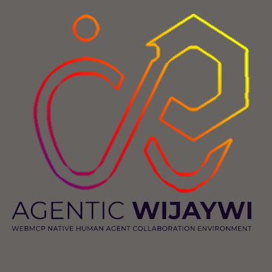

# Wijaywi Web Agent Reliability Lab

<p align="center">
  
</p>

> **AI agents can act on the web.**
> Wijaywi makes their actions observable, evidence-backed, uncertainty-aware, falsifiable, and accountable.

This project implements the **Agentic Wijaywi** architecture, a human-agent collaboration environment that treats AI agents as persistent goal-maintaining entities operating on a shared world model via **WebMCP**.

## The Problem
As AI agents become capable of operating on web properties, we need a trustworthy interface for understanding their beliefs, hypotheses, and provenance. This is an Agent Reliability and Epistemic Collaboration Layer for the Open Web.

## WebMCP Integration
Agents interact directly with this environment through `document.modelContext.registerTool`.
**You can inspect the WebMCP source code at:** `src/lib/webmcp/registerTools.ts`.

## Features
- **Epistemic Engine**: Explicit representation of Objective, Hypothesis, Evidence, and Belief.
- **Hypothesis Ledger**: Tracks failed attempts and unverified claims.
- **Falsifier Agent Role**: An adversarial approach to prevent confirmation bias.
- **Zero-API-Key Demo**: A full simulated scenario accessible in `/demo`.

## Local Setup
1. Clone the repository.
2. Run `npm install`.
3. Run `npm run dev`.
4. Navigate to `http://localhost:3000`.

## Testing
Run unit tests with Vitest:
```bash
npm run test
```

## Security
- Input schemas validated using Zod.
- Sandbox and Production operations have explicit `PermissionLevel` boundaries requiring human approval.

## License
MIT License.
